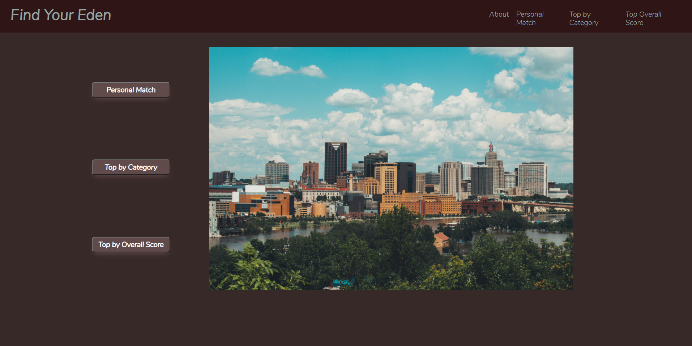
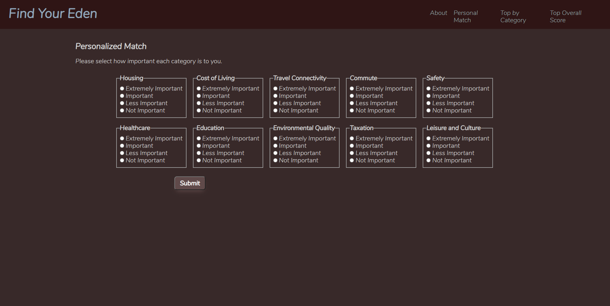
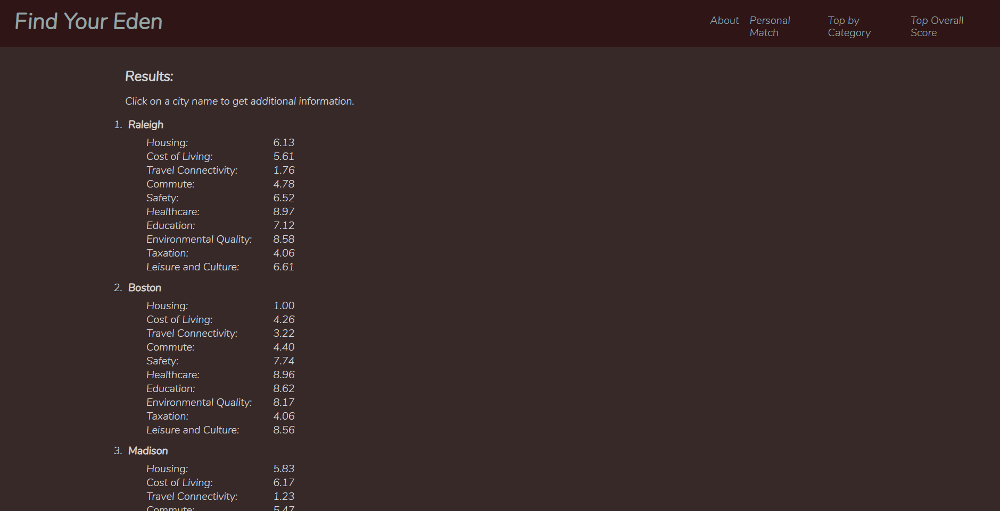
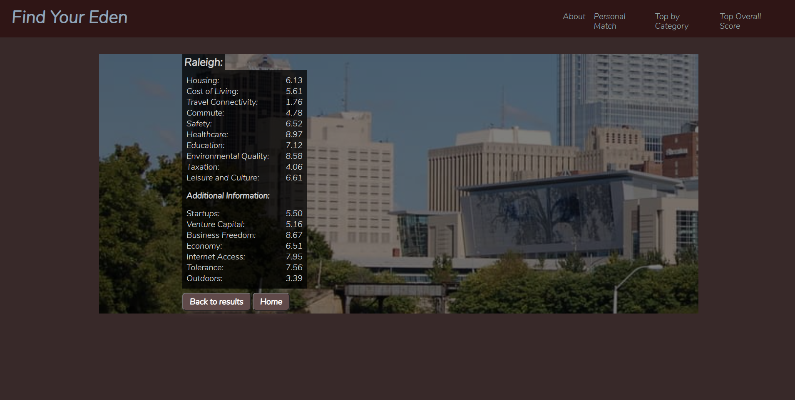

# Find Your Eden

A simple application to help users explore United States cities based on what's important to them.

## Live Demo

[Find Your Eden](https://alannawellenkamp.github.io/Find-Your-Eden/)

## Screenshots

## Summary

This app takes information from the [teleport.org](https://www.teleport.org) API and presents it to the user in a variety of ways.
The user can view a ranked list of cities based on how important each of ten categories is to them.
The user can view a ranked list of cities based on a single category.
The user can view a ranked list of cities based on the ten categories without preference weight.
The user can view additional information about any city presented to them.

## Built With

-HTML
-CSS
-javascript
-jQuery

